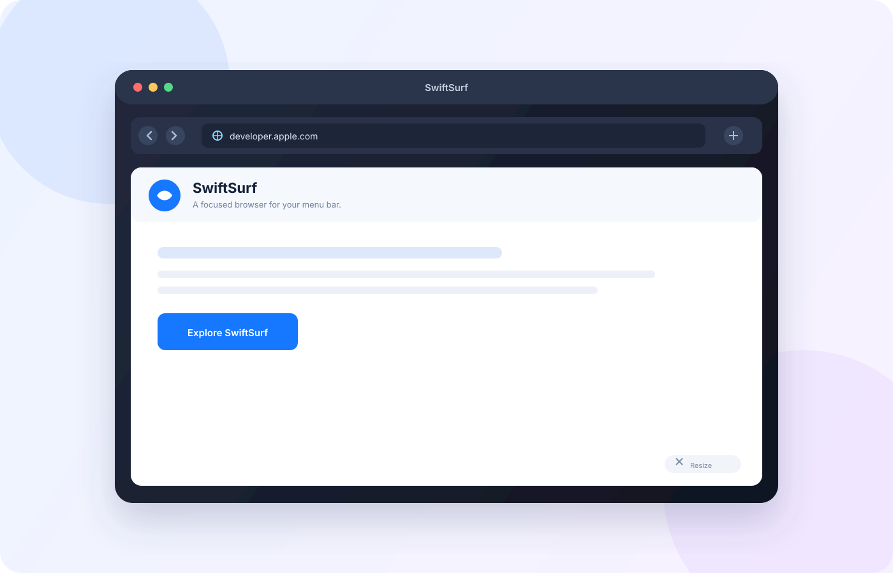
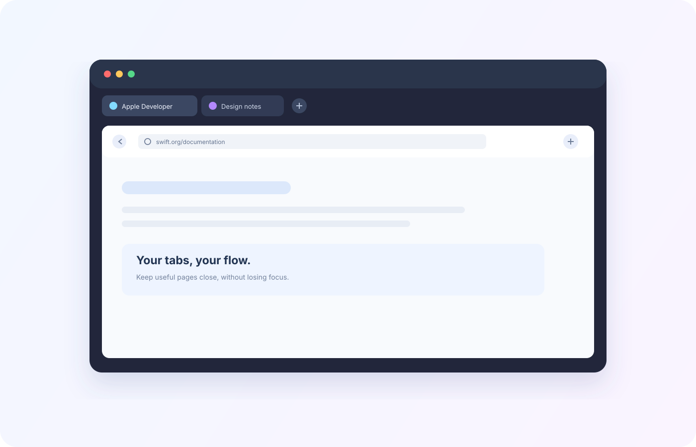

# SwiftSurf

<p align="center">
  <strong>A focused, native browser for the macOS menu bar.</strong><br>
  Search, browse, and get back to your work without opening another full-size browser window.
</p>

[](https://github.com/zfeder/swiftsurf/actions/workflows/ci.yml)
[](https://github.com/zfeder/swiftsurf/releases/latest)
[](https://github.com/zfeder/swiftsurf/releases)

> **Download SwiftSurf:** [get the latest DMG from GitHub Releases](https://github.com/zfeder/swiftsurf/releases/latest)

## Preview

<p align="center">
  
</p>

<p align="center">
  
</p>

## Why SwiftSurf?

SwiftSurf is a compact `WKWebView` browser that stays one click away in the
menu bar. It combines a fast popup workflow with the familiar controls you
expect from a desktop browser, while keeping its footprint deliberately small.

## Highlights

- **Instant access** from the macOS menu bar, or from any app with a global shortcut (`⌥Space` by default)
- **Keep open or detach**: pin the popup so it stays visible, or drag it away from the menu bar to turn it into a floating window
- **Responsive popup** with a native bottom-right resize handle
- **Tabs** with favicons, drag-to-reorder, `⌘1`–`⌘9`, and reopening of closed tabs
- **Session restore**: your tabs come back next time, loaded only when you open them
- **Smart address bar** with suggestions from bookmarks and history, `localhost`/IP support, and a choice of search engine (Google, DuckDuckGo, Bing, Ecosia, Startpage, Kagi)
- **Built-in tracker blocking** using a native WebKit content rule list
- **Find in page**, per-site **zoom**, **reader mode**, **Picture in Picture**, and **request mobile website**
- **Favorites bar** and a **start page** with your bookmarks and recent pages
- **Searchable history** and a **downloads manager** with progress, cancel, and Show in Finder
- **Private browsing**: private tabs share one temporary data store, which is discarded when private mode ends
- **Sign-in pop-ups** (OAuth, payments) open in their own tab and close themselves when they finish
- **Web page dialogs and file uploads**: `alert`, `confirm`, `prompt`, and `<input type="file">` work inside the popup
- **Camera, microphone, and location** available to websites only after you approve access
- **Five interface languages**: English, Italian, Spanish, French, and German (follows the system language by default)

## Install

### Packaged app

Download the latest **[SwiftSurf.dmg from GitHub Releases](https://github.com/zfeder/swiftsurf/releases/latest)**,
open it, and drag **SwiftSurf** into the **Applications** folder. On first
launch, macOS may ask you to confirm that you want to open an app downloaded
from the internet.

The installer is generated automatically by GitHub Actions whenever a version
tag such as `v1.0.0` is pushed. You do not need Xcode to install a published
release.

### Build from source

Requirements:

- macOS 14.5 or later
- Xcode 15 or later
- Apple Silicon or Intel Mac

```bash
git clone https://github.com/zfeder/swiftsurf.git
cd swiftsurf
xcodebuild -project swiftsurf.xcodeproj \
  -scheme swiftsurf \
  -configuration Release \
  -destination 'platform=macOS' \
  build
```

The built app is placed in Xcode's DerivedData products directory.

## Create an installer DMG

The repository includes a repeatable packaging script:

```bash
./scripts/package-dmg.sh
```

It creates `dist/SwiftSurf.dmg`, containing the app and an Applications
shortcut for drag-and-drop installation.

## Publishing a release

Create and push a version tag:

```bash
git tag v1.0.0
git push origin v1.0.0
```

GitHub Actions builds the Release configuration on a macOS runner and attaches
`SwiftSurf.dmg` to a GitHub Release. The latest installer is always available
at the Releases page above.

## Keyboard shortcuts

| Shortcut | Action |
| --- | --- |
| `⌥Space` | Show or hide SwiftSurf from any app (configurable in Settings) |
| `⌘L` | Focus the address bar |
| `⌘T` / `⇧⌘T` | Open a new tab / reopen the last closed tab |
| `⌘W` | Close the current tab |
| `⌘1`…`⌘9`, `⌃Tab`, `⌃⇧Tab` | Switch tabs |
| `⌘R` / `⌘[` / `⌘]` | Reload / back / forward |
| `⌘F`, `⌘G`, `⇧⌘G` | Find in page, next and previous match |
| `⌘=` / `⌘-` / `⌘0` | Zoom in / zoom out / actual size (remembered per site) |
| `⇧⌘R` | Reader mode |
| `⌘D` | Add or remove bookmark |
| `⇧⌘Y` | Show browsing history |
| `⌥⌘L` | Show downloads |
| `⌘`-click | Open a link in a background tab |

## Privacy

Normal browsing uses WebKit's standard local website data store so logins and
preferences work as expected. Private tabs use a non-persistent store and are
not added to SwiftSurf history. Use **Clear browsing data** in the tab menu to
remove normal WebKit website data, local history, and saved zoom levels.
Tracker blocking is on by default and can be turned off in Settings. Bookmarks
and history are stored as JSON files in SwiftSurf's Application Support folder.
Downloads are saved directly to your Downloads folder. SwiftSurf can also hide
its Dock icon while remaining available from the menu bar; this preference is
available in the Settings tab.

## License

SwiftSurf is released under the [MIT License](LICENSE). See
[CONTRIBUTING.md](CONTRIBUTING.md) for development and contribution
guidelines.
